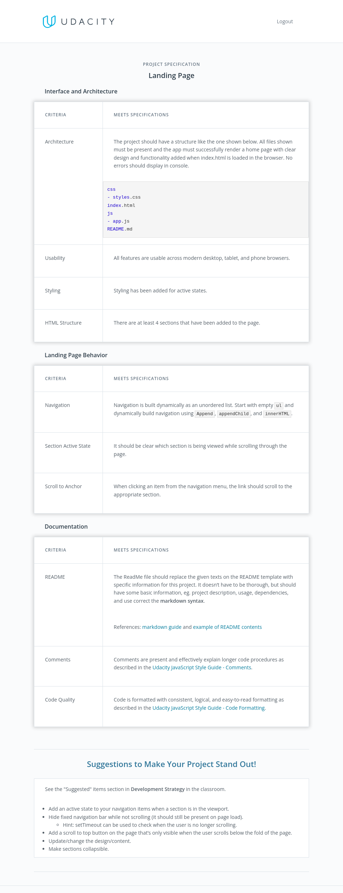
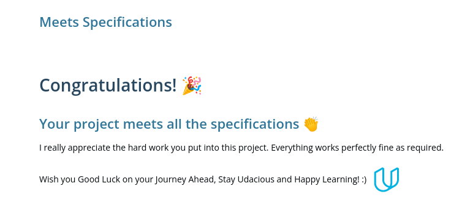

# Landing Page

The second project for the **javascript and the DOM** chapter of the Udacity's
Front End Developer Nanodegree.

This project required me to build a multi-section landing page, with a
dynamically updating navigational menu based on the amount of content that is
added to the page.

## Project Files

It consists of only three main files, as shown in the structure below:

```
index.html
css
- styles.css
js
- app.js
README.md
```

It will serve as a canvas to practice heavy DOM manipulation relying only on
pure JavaScript, CSS and HTML. **NO EXTERNAL LIBRARIES**

## Rubric

This project has been evaluated by a Udacity code reviewer according to the Personal Blog Website project specifications below.

<details>
<summary>Project specification:</summary>

</details>

## Deployed version:

https://udacity-fend-landingpage.netlify.app/

- [x] Project reviewed and passed successfully.
      
